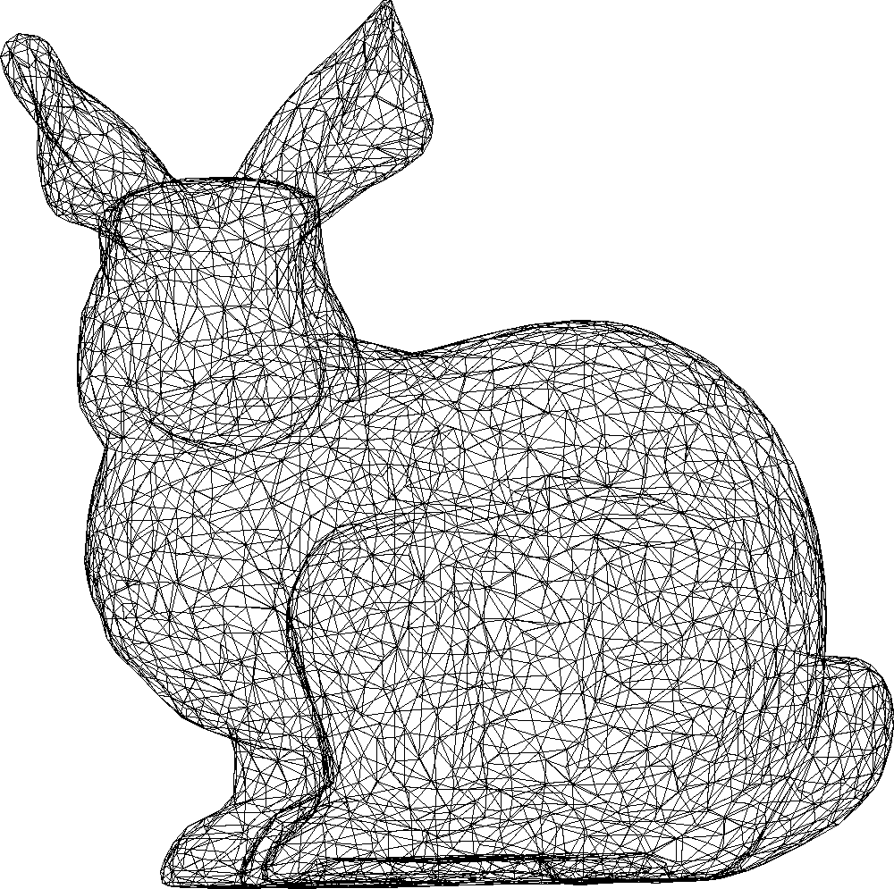
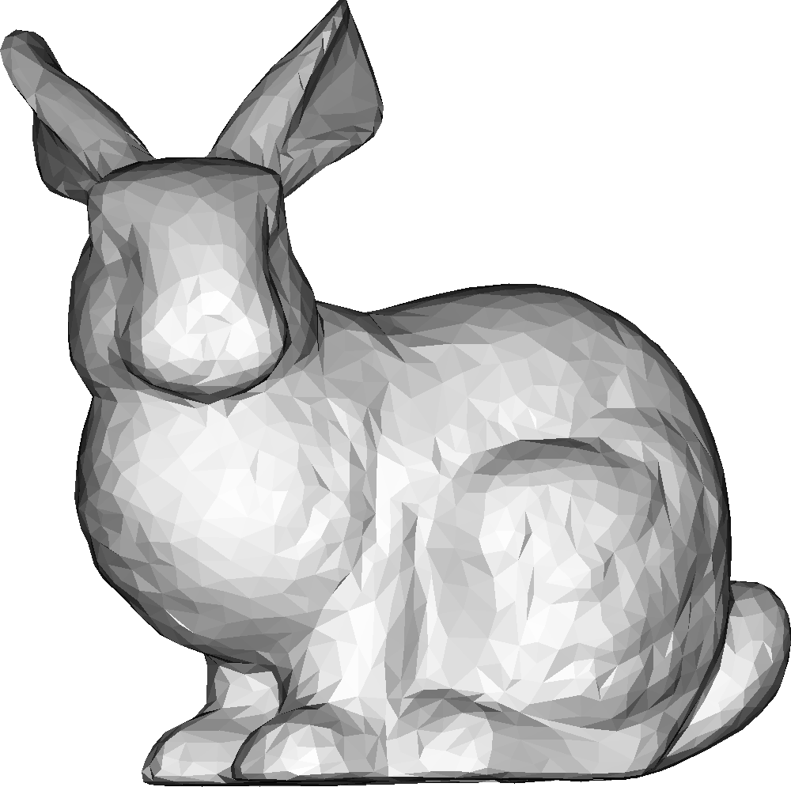

# minirenderer
A minimal renderer in pure Python.

## bunny
This is the [Stanford bunny](https://en.wikipedia.org/wiki/Stanford_bunny).

    

### Rendering modes

|Mode|Render|
|---|---|
|Wireframe||
|Flat||

## head
This is a head.

    

